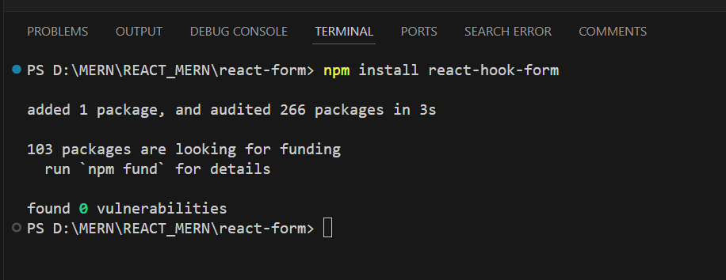

<h1 align ="center">REACT FORM VALIDATION</h1>
<h2><a href="https://mmjtechnologies-react-form.netlify.app/" target="_blank">Website Link</a></h2>

 <h3  align ="center"><b>Form Validation using react-hook-form</b></h3>
  

It is a registration  form with full validation using useForm Hook in react with a beautiful glass background effect and when the error will occur by giving input in the form, then the error will show in red colour just below the text field.

<ul>
 <li>Showing error</li> 
   
</ul>
<h2>Atfirst install hook on your code editor terminal or in cmd - by run this command</h2>
<h2>npm install react-hook-form </h2>
   
<ul>
 <h2><b> Hooks </b></h2>
 <li>useForm</li>
 <h1><b>Programing Languages<b></h1>
<h2><b>Front-End</b></h2>
<li>HTML5</li>
 <li>CSS3</li>
  <li>React js</li>
</ul>
<ul>
<h2><b> Back-End </b></h2>
 <li>Node js</li>
</ul>

